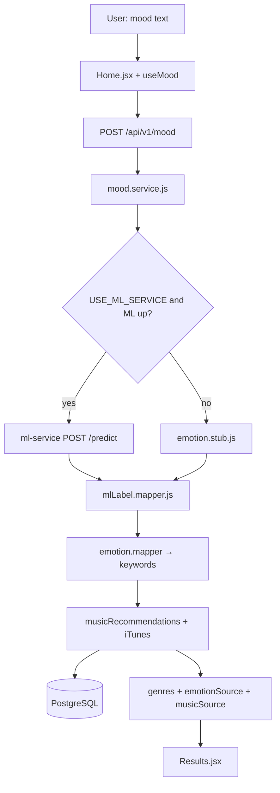

# MoodMix Architecture

> **Build history:** [PHASES.md](./PHASES.md) — Phase 1 through Phase 4 step logs.  
> **File-by-file map:** [PROJECT_GUIDE.md](./PROJECT_GUIDE.md).  
> **REST reference:** [API.md](./API.md).

## System overview (current)

MoodMix is a monorepo with three runnable services plus PostgreSQL. Music recommendations use the **iTunes Search API** (no API key).

```
┌─────────────┐   REST + session cookie   ┌─────────────┐   HTTP POST    ┌─────────────┐
│   React     │ ────────────────────────► │   Express   │ ─────────────► │   FastAPI   │
│  Vite :5173 │ ◄──────────────────────── │  Node :5000 │ ◄───────────── │ Python :8000│
└─────────────┘                           └──────┬──────┘                └─────────────┘
                                                 │
                    ┌────────────────────────────┼────────────────────────────┐
                    │ SQL                      │ HTTPS (no key)               │
                    ▼                          ▼                              │
             ┌─────────────┐            ┌─────────────┐                       │
             │ PostgreSQL  │            │ iTunes API  │                       │
             │ users,      │            └─────────────┘                       │
             │ mood_history│                                                  │
             │ playlist_   │                                                  │
             │ history     │                                                  │
             └─────────────┘                                                  │
```

## Active request flow (logged-in user)

When a user submits mood text on **Home**:

1. **Frontend** — `Home.jsx` → `useMood` → `POST /api/v1/mood` (cookie `moodmix.sid`)
2. **Backend** — `requireAuth` → `mood.service.processMoodText()`
3. **Emotions** — `ml.service.getEmotionPrediction()` → `POST ml-service:/predict` **or** `emotion.stub.js`
4. **Map labels** — `mlLabel.mapper.js` (HF `joy` → MoodMix `happy`, etc.)
5. **Keywords** — `emotion.mapper.js` → `spotifyKeywords[]` (stored in DB; naming is legacy)
6. **Music** — `musicRecommendations.service.js` → `emotionGenre.mapper` → up to **3 genres**, **3 tracks each** via `itunes.service.js` (fallback: `mockGenres.service.js`)
7. **Persist** — `mood_history` + `playlist_history` JSONB `{ genres: [...] }` for `user_id`
8. **Frontend** — `setMoodAnalysis()` → navigate **Results** → `GenreRecommendations` + `TrackRow`



## Service responsibilities

### Frontend (`frontend/`)

| Concern | Implementation |
|---------|----------------|
| Routing | `AppRoutes.jsx` — `/`, `/results`, `/login`, `/signup`, `/history` |
| Auth gate | `ProtectedRoute.jsx` wraps Home, Results, History |
| Global state | `AppContext.jsx` — `user`, `moodText`, `emotions`, `analysis` |
| API client | `api.js` — Axios with `withCredentials: true` |
| Mood flow | `useMood.js`, `Home.jsx` |
| History | `useHistory.js`, `History.jsx` |
| Music UI | `GenreRecommendations.jsx`, `TrackRow.jsx` (live); `PlaylistGrid` / `TrackList` unused |

Calls **backend only** — never ML or iTunes directly. Dev server proxies `/api` → `:5000`.

### Backend (`backend/`)

| Layer | Role |
|-------|------|
| `routes/` | `/api/v1/mood`, `/auth`, `/history` |
| `middleware/auth.middleware.js` | Session `userId` on protected routes |
| `mood.service.js` | Orchestrates ML/stub → keywords → genres → DB |
| `ml.service.js` | HTTP client to Python; stub fallback |
| `musicRecommendations.service.js` | Genre pick + iTunes search |
| `itunes.service.js` / `mockGenres.service.js` | Live tracks + per-genre fallback |

### ML service (`ml-service/`)

- Model: `j-hartmann/emotion-english-distilroberta-base` (loaded at startup)
- `GET /` — health + `model_loaded`
- `POST /predict` — `{ text }` → `{ predictions: [{ label, score }] }`
- No database; no auth

### PostgreSQL

| Table | Purpose |
|-------|---------|
| `users` | Email/password accounts (`password_hash`, `display_name`) |
| `session` | Express session store (`connect-pg-simple`) |
| `mood_history` | Per-user mood text, emotions, keywords |
| `playlist_history` | JSONB per mood — `{ genres: [{ id, name, tracks, ... }] }` |

## Response fields (mood analyze)

| Field | Meaning |
|-------|---------|
| `emotionSource` | `"ml"` or `"stub"` |
| `musicSource` | `"itunes"` or `"mock"` |
| `genres` | Array of genre sections with `tracks[]` |
| `mlPredictions` | Raw HF scores when `emotionSource` is `"ml"` |
| `musicMessage` | User-facing warning when iTunes unavailable |

## Environment (backend)

| Variable | Purpose |
|----------|---------|
| `DATABASE_URL` | PostgreSQL connection |
| `SESSION_SECRET` | Session cookie signing |
| `ML_SERVICE_URL` | Default `http://127.0.0.1:8000` |
| `USE_ML_SERVICE` | `true` (default) — `false` forces stub only |
| `FRONTEND_URL` | CORS in production |

## Dev URLs

| Service | URL |
|---------|-----|
| Frontend | http://127.0.0.1:5173 |
| Backend | http://127.0.0.1:5000 |
| ML | http://127.0.0.1:8000 |

Use **127.0.0.1** (not `localhost`) so session cookies stay consistent.

## Related documentation

- [PHASES.md](./PHASES.md) — Phase 1–4 changelog
- [API.md](./API.md) — Endpoint reference
- [BACKEND.md](./BACKEND.md) — Backend file-by-file reference