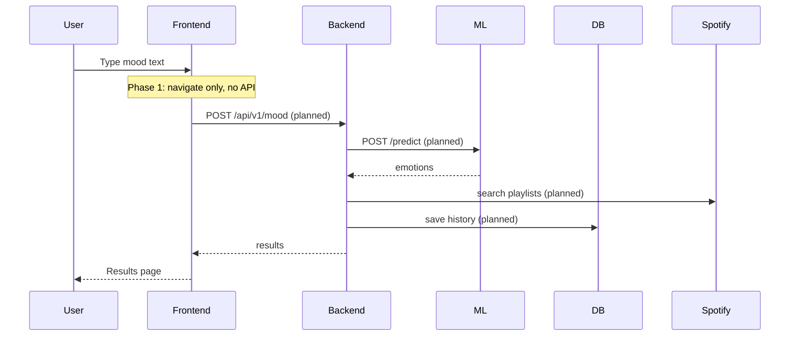
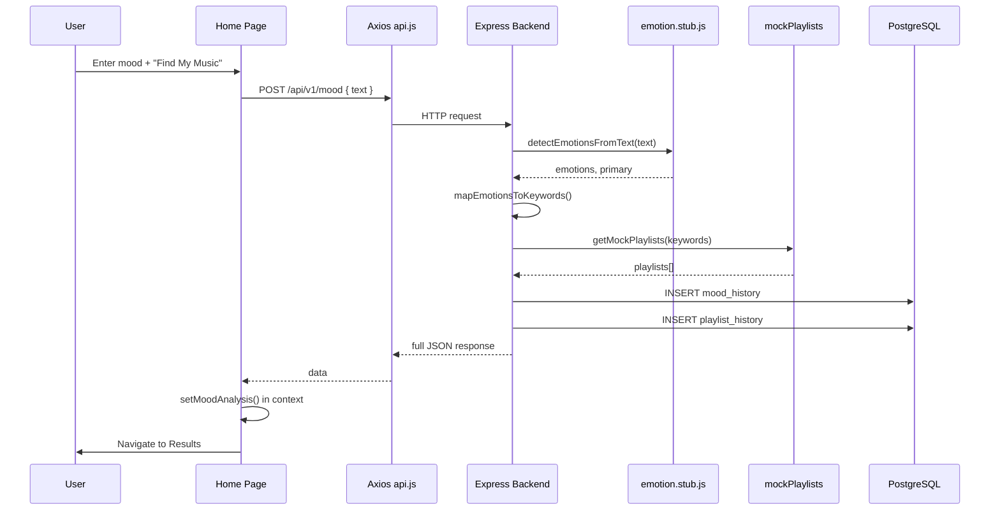

# MoodMix Development Phases

This document records **what was built in each phase**, **what changed**, and **how data flows** through the project today. Use it as the main guide to understand the codebase.

| Phase | Status | Summary |
|-------|--------|---------|
| **Phase 1** | Complete | Monorepo scaffold, folder structure, placeholder APIs, PostgreSQL schema |
| **Phase 2** | Complete | Frontend ↔ backend wired, rule-based emotions, mock playlists, history saved |
| **Phase 3** | Complete | HuggingFace ML microservice + backend integration with stub fallback |
| **Phase 2.5** | Complete | Session auth (email/password), per-user history, signup/login pages |
| **Phase 4** | Complete | Genre-based music via iTunes Search (2–3 songs per genre, previews) |

---

## Phase 1 — Scaffold & Architecture

**Goal:** Create a professional monorepo layout with minimal runnable code. **No full business logic**, no complete UI, no ML or Spotify integration.

### What was created

```
moodmix/
├── frontend/          React + Vite + Tailwind + React Router
├── backend/           Express REST API (versioned /api/v1)
├── ml-service/        FastAPI (placeholder only — not required to run app today)
├── docs/              Architecture & API docs
├── docker-compose.yml
└── package.json       npm workspaces (frontend + backend)
```

### Phase 1 — Backend

| Area | What exists | Purpose |
|------|-------------|---------|
| `src/routes/` | `mood`, `music`, `auth`, `history` | Route placeholders |
| `src/controllers/` | One file per domain | HTTP handlers |
| `src/services/` | `spotify/`, `ml/`, `mood/` | Service layer (stubs) |
| `src/models/` | User, MoodHistory, PlaylistHistory | Data layer (later PostgreSQL) |
| `src/middleware/` | `errorHandler`, `requestLogger` | Cross-cutting concerns |
| `src/db/schema.sql` | 3 tables | PostgreSQL schema |
| `src/config/database.js` | `pg` pool + auto-run schema on startup | DB connection |

**Database change (during Phase 1 follow-up):** MongoDB was replaced with **PostgreSQL**.

**Phase 1 log — backend routes (placeholders only):**

```
GET  /health
POST /api/v1/mood          → called ML service (optional)
GET  /api/v1/music/playlists
GET  /api/v1/music/recommend
GET  /api/v1/auth/login
GET  /api/v1/auth/callback
POST /api/v1/auth/logout
GET  /api/v1/history
POST /api/v1/history
```

### Phase 1 — Frontend

| Area | What exists | Phase 1 behavior |
|------|-------------|------------------|
| `pages/Home` | Mood text input | Submit only navigated to `/results` — **no API call** |
| `pages/Results` | Playlist grid shell | Empty playlists |
| `pages/History` | Static text | No fetch |
| `pages/Login` | Button | No OAuth redirect |
| `services/api.js` | Axios client | Defined but unused from pages |
| `hooks/useMood.js` | Hook | Defined but unused |
| `context/AppContext.jsx` | Basic state | `moodText`, `emotions` only |

### Phase 1 — ML service (scaffold only)

- FastAPI app with `POST /predict` and `GET /health` placeholders
- Hardcoded emotion response
- **Not wired to backend until Phase 3**

### Phase 1 — Intended flow (planned, not fully working)



### Phase 1 — Explicitly NOT done

- Full UI / styling
- Real emotion detection
- Spotify API calls
- Frontend calling backend
- User authentication flow
- Automated tests

---

## Phase 2 — Connect Frontend, Backend & Database

**Goal:** Make the app **usable end-to-end** without the ML microservice. Persist mood + playlists in PostgreSQL. Improve error handling and UX.

### Phase 2 — Key decisions

| Decision | Reason |
|----------|--------|
| Skip ML service for now | Faster iteration; rule-based stub in backend |
| Mock playlists | Spotify API needs credentials; mock proves UI flow |
| Auto-save on `POST /mood` | One request = analyze + recommend + history |
| `emotion.stub.js` in backend | Same file can be swapped for ML call in Phase 3 |

### Phase 2 — Backend changes

| File | Change |
|------|--------|
| `services/mood/emotion.stub.js` | **NEW** — keyword rules detect emotions from text |
| `services/music/mockPlaylists.service.js` | **NEW** — returns playlist cards from keywords |
| `services/mood/mood.service.js` | **UPDATED** — stub emotions → keywords → mock playlists → save DB |
| `services/spotify/spotify.service.js` | **UPDATED** — delegates to mock playlists |
| `controllers/history.controller.js` | **UPDATED** — GET returns moods **with playlists** |
| `controllers/mood.controller.js` | **UPDATED** — validation + full pipeline response |
| `models/PlaylistHistory.model.js` | **FIX** — `JSON.stringify` for JSONB column |
| `services/ml/ml.service.js` | **Unused** in Phase 2 (kept for Phase 3) |

**Phase 2 log — `POST /api/v1/mood` pipeline (current):**

```
1. Validate text (mood.validator.js)
2. detectEmotionsFromText()     → emotion.stub.js
3. mapEmotionsToKeywords()      → emotion.mapper.js + constants/emotions.js
4. getMockPlaylists(keywords)   → mockPlaylists.service.js
5. MoodHistory.create()         → PostgreSQL mood_history
6. PlaylistHistory.create()     → PostgreSQL playlist_history
7. Return JSON to frontend
```

**Phase 2 — Example response:**

```json
{
  "text": "I feel tired and stressed but want to focus",
  "emotions": ["anxious", "calm", "energetic"],
  "primary": "anxious",
  "spotifyKeywords": ["ambient", "calming", "peaceful", "meditation", "workout", "dance"],
  "playlists": [
    { "id": "7", "name": "Ambient Anxiety Relief", "imageUrl": "...", "externalUrl": "..." }
  ],
  "historyId": "uuid"
}
```

### Phase 2 — Frontend changes

| File | Change |
|------|--------|
| `pages/Home/Home.jsx` | Calls `useMood` → `POST /mood` → stores result → navigates to Results |
| `pages/Results/Results.jsx` | Shows emotions, keywords, playlists (later: genres + tracks); redirects if no session |
| `pages/History/History.jsx` | `useHistory` hook → `GET /history` with refresh |
| `pages/Login/Login.jsx` | Placeholder only (updated in Phase 2.5 to email/password) |
| `context/AppContext.jsx` | `analysis` object: `primary`, `spotifyKeywords`, `playlists`, `historyId` (genres added Phase 4) |
| `hooks/useHistory.js` | **NEW** — fetch history list |
| `hooks/useMood.js` | **UPDATED** — surfaces API error messages |
| `services/api.js` | **UPDATED** — timeout + “backend unreachable” message |
| `components/common/ErrorMessage.jsx` | **NEW** — shared error UI |

### Phase 2 — Flow at the time (historical)

> **Superseded by Phases 2.5, 3, and 4.** Today: session auth, ML + stub emotions, iTunes genres (see [ARCHITECTURE.md](./ARCHITECTURE.md)).



### Phase 2 — What was still placeholder (at end of Phase 2)

| Feature | Phase 2 behavior | Later phase |
|---------|------------------|-------------|
| Emotion detection | `emotion.stub.js` only | Phase 3 — ML service |
| Music | `mockPlaylists.service.js` | Phase 4 — iTunes genres |
| Login | Placeholder / Spotify OAuth experiments | Phase 2.5 — email/password sessions |
| User accounts | `user_id` nullable | Phase 2.5 — required `requireAuth` |

### Phase 2 — Services you need running

For full Phase 2 experience:

```bash
# Required
PostgreSQL (database: moodmix)
backend   → npm run dev   (port 5000)
frontend  → npm run dev   (port 5173)

# NOT required for Phase 2
ml-service
```

---

## Phase 2.5 — Session-based auth & per-user history

**Goal:** Replace Spotify OAuth with email/password accounts, server sessions, and history scoped to the logged-in user.

### Backend

| Area | Change |
|------|--------|
| `users` table | `email`, `password_hash`, `display_name` (Spotify columns removed) |
| `session` table | `connect-pg-simple` store for `express-session` |
| `POST /auth/signup`, `POST /auth/login` | bcrypt passwords, `req.session.userId` |
| `GET /auth/me`, `POST /auth/logout` | Session cookie `moodmix.sid` |
| `POST /mood`, `GET /history` | `requireAuth` — saves/fetches only for session user |
| Removed | `spotify.auth.js`, `/auth/spotify`, `/auth/callback` |

### Frontend

| Page | Behavior |
|------|----------|
| `/signup` | Create account → auto-login → Home |
| `/login` | Email/password → redirect to intended page |
| `/`, `/results`, `/history` | Protected — redirect to login if no session |

On first startup against an old Spotify-schema database, `migrate-auth.sql` runs automatically (drops old history tables — dev reset).

---

## Phase 4 — Genre music recommendations (iTunes)

**Goal:** After mood detection, show **2–3 music genres** matched to emotions, with **3 real songs per genre** (30s previews when available).

| Piece | Implementation |
|-------|----------------|
| API | [iTunes Search API](https://developer.apple.com/library/archive/documentation/AudioVideo/Conceptual/iTuneSearchAPI/) — no API key |
| Genre pick | `emotionGenre.mapper.js` + `constants/genres.js` |
| Search | `itunes.service.js` — parallel search per genre |
| Fallback | `mockGenres.service.js` if iTunes returns no results |
| UI | `GenreRecommendations.jsx` on Results + History |

**Example:** mood `happy` + `energetic` → genres Pop, Dance, EDM — each with 3 tracks from iTunes.

Spotify Client Credentials code remains in repo but is **not** used in the mood pipeline (Premium 403 on many dev accounts).

---

## System diagram (current state — after Phase 4)

```
┌──────────────────────────────────────────────────────────────────┐
│                    BROWSER — React :5173                          │
│  Login/Signup ──session──► Protected: Home, Results, History      │
│  Home ──POST /mood──► Results (GenreRecommendations + TrackRow) │
│  History ──GET /history──► past moods + saved genres              │
│         AppContext: user, moodText, emotions, analysis.genres     │
└────────────────────────────┬─────────────────────────────────────┘
                             │ REST /api/v1/*  (cookie moodmix.sid)
                             ▼
┌──────────────────────────────────────────────────────────────────┐
│                    EXPRESS BACKEND :5000                          │
│  auth ──► express-session + PostgreSQL session table              │
│  mood.service ──► ml.service ──► ml-service :8000 OR emotion.stub│
│              ──► emotion.mapper (keywords)                        │
│              ──► musicRecommendations ──► itunes.service          │
│              ──► mockGenres (per-genre fallback)                  │
│              ──► mood_history + playlist_history (JSONB genres) │
└────────────┬───────────────────────────────┬─────────────────────┘
             │ SQL                           │ HTTPS
             ▼                               ▼
      ┌─────────────┐                 ┌─────────────┐
      │ PostgreSQL  │                 │ iTunes API  │
      │ users       │                 └─────────────┘
      │ mood_history│
      │ playlist_   │    ml-service :8000 — POST /predict
      │ history     │
      │ session     │
      └─────────────┘
```

---

## Database tables (reference)

| Table | Stores |
|-------|--------|
| `users` | Email, `password_hash`, `display_name` (Phase 2.5+) |
| `session` | Express session payloads (`connect-pg-simple`) |
| `mood_history` | Per-user mood text, `emotions[]`, `primary_emotion`, `spotify_keywords[]` |
| `playlist_history` | JSONB per mood — today `{ genres: [...] }` (legacy entries may have `playlists[]`) |

**Relationship:** One `mood_history` row → typically one `playlist_history` row per analysis.

---

## File map — “where does this step happen?” (current)

| Step in flow | File |
|--------------|------|
| User types mood | `frontend/src/pages/Home/Home.jsx` |
| HTTP call | `frontend/src/services/api.js` → `moodApi.analyze()` |
| Auth gate | `frontend/src/components/auth/ProtectedRoute.jsx` |
| Route | `backend/src/routes/mood.routes.js` |
| Controller | `backend/src/controllers/mood.controller.js` |
| Orchestration | `backend/src/services/mood/mood.service.js` |
| Detect emotions (ML) | `ml-service` → `backend/src/services/ml/ml.service.js` |
| Detect emotions (fallback) | `backend/src/services/mood/emotion.stub.js` |
| Map HF → MoodMix | `backend/src/services/ml/mlLabel.mapper.js` |
| Map to keywords | `backend/src/services/mood/emotion.mapper.js` |
| Pick genres | `backend/src/services/mood/emotionGenre.mapper.js` + `constants/genres.js` |
| Fetch tracks | `backend/src/services/music/itunes.service.js` |
| Genre fallback | `backend/src/services/music/mockGenres.service.js` |
| Save mood + music | `MoodHistory.model.js`, `PlaylistHistory.model.js` |
| Show results | `frontend/src/pages/Results/Results.jsx` → `GenreRecommendations.jsx` |
| Load history | `frontend/src/hooks/useHistory.js` → `History.jsx` |

---

## Phase 3 — ML microservice & backend integration

**Goal:** Run a real HuggingFace emotion model in Python and call it from the Node backend, with safe fallback if ML is offline.

### Phase 3 — Step log (chronological)

| Step | Action | Files / notes |
|------|--------|----------------|
| 3.1 | Implemented FastAPI + `transformers` pipeline | `ml-service/requirements.txt` — added `transformers`, `torch` |
| 3.2 | Load model once at startup | `ml-service/app/services/model_loader.py` — `j-hartmann/emotion-english-distilroberta-base` |
| 3.3 | Raw inference layer | `ml-service/app/services/huggingface_service.py` — `pipeline(text)` → `[{label, score}]` |
| 3.4 | API routes | `GET /` health, `POST /predict` body `{ "text": "..." }` |
| 3.5 | Pydantic schemas | `ml-service/app/schemas/predict.py` |
| 3.6 | Documented ML service | `ml-service/README.md` |
| 3.7 | Backend ML client | `backend/src/services/ml/ml.service.js` — `callMlPredict()`, `getEmotionPrediction()` |
| 3.8 | HF label → MoodMix map | `backend/src/services/ml/mlLabel.mapper.js` — joy→happy, fear→anxious, etc. |
| 3.9 | Wire mood pipeline | `backend/src/services/mood/mood.service.js` — uses ML first, stub fallback |
| 3.10 | Env flag | `USE_ML_SERVICE=true` in `backend/.env` — set `false` to force stub |
| 3.11 | API response fields | `emotionSource` (`ml` \| `stub`), `mlPredictions` (raw scores) |
| 3.12 | Frontend Results | Shows `emotionSource`, `musicSource`, top 3 ML scores |
| 3.13 | Phase docs updated | `docs/PHASES.md`, `ARCHITECTURE.md`, `API.md` |

### Phase 3 — ML service (Python)

**Model:** `j-hartmann/emotion-english-distilroberta-base`  
**Labels:** `anger`, `disgust`, `fear`, `joy`, `neutral`, `sadness`, `surprise`

```
GET  /           → health + model_loaded
POST /predict    → { text, predictions: [{ label, score }, ...] }
```

**Run ML service:**

```bash
cd ml-service
source venv/Scripts/activate
pip install -r requirements.txt
uvicorn app.main:app --reload --host 127.0.0.1 --port 8000
```

### Phase 3 — Backend integration

**Flow when `USE_ML_SERVICE=true` (default):**

```
POST /api/v1/mood
  → mood.service.js
  → ml.service.js → getEmotionPrediction()
       → POST http://127.0.0.1:8000/predict
       → mlLabel.mapper.js (HF labels → MoodMix emotions)
       → [on failure] emotion.stub.js
  → emotion.mapper.js (MoodMix → keywords)
  → musicRecommendations.service.js → iTunes (+ mockGenres fallback)  [Phase 4]
  → PostgreSQL (genres in playlist_history JSONB)
```

**New / updated backend files:**

| File | Role |
|------|------|
| `services/ml/ml.service.js` | HTTP client + fallback orchestration |
| `services/ml/mlLabel.mapper.js` | Maps `joy`→`happy`, `fear`→`anxious`, etc. |
| `services/mood/emotion.stub.js` | Fallback only (unchanged logic) |
| `services/mood/mood.service.js` | Calls `getEmotionPrediction()` instead of stub directly |
| `config/env.js` | `USE_ML_SERVICE` boolean |

**Example `POST /api/v1/mood` response (Phase 3+; genres added in Phase 4):**

```json
{
  "text": "I feel tired and stressed but want to focus",
  "emotions": ["anxious", "sad"],
  "primary": "anxious",
  "spotifyKeywords": ["ambient", "calming", "sad", "melancholy"],
  "genres": [{ "id": "ambient", "name": "Ambient", "tracks": [...] }],
  "emotionSource": "ml",
  "musicSource": "itunes",
  "mlPredictions": [
    { "label": "fear", "score": 0.45 },
    { "label": "sadness", "score": 0.28 }
  ],
  "historyId": "uuid"
}
```

If ML is down, `emotionSource` is `"stub"` and `mlPredictions` is `null`.

### Phase 3 — Label mapping reference

| HuggingFace label | MoodMix emotions |
|-------------------|------------------|
| joy | happy, energetic |
| sadness | sad |
| anger | angry |
| fear | anxious |
| disgust | angry |
| surprise | energetic, happy |
| neutral | calm, relaxed |

### Phase 3 — Services required to run

```bash
# Terminal 1 — ML (port 8000)
cd ml-service && uvicorn app.main:app --reload --port 8000

# Terminal 2 — Backend (port 5000)
cd backend && npm run dev

# Terminal 3 — Frontend (port 5173)
cd frontend && npm run dev

# PostgreSQL — must be running for history
```

### Phase 3 — Verify integration

```bash
# ML direct
curl http://127.0.0.1:8000/
curl -X POST http://127.0.0.1:8000/predict -H "Content-Type: application/json" -d "{\"text\":\"I am so happy today\"}"

# Full stack via backend
curl -X POST http://127.0.0.1:5000/api/v1/mood -H "Content-Type: application/json" -d "{\"text\":\"I am so happy today\"}"
# Expect: "emotionSource": "ml" and mlPredictions array
```

### Phase 3 — System diagram (after Phase 3; music extended in Phase 4)

```
Frontend ──POST /api/v1/mood──► Backend (requireAuth)
                                  │
                    ┌─────────────┴─────────────┐
                    ▼                           ▼
            ml-service :8000              emotion.stub.js
            POST /predict                 (fallback)
                    │
                    ▼
            mlLabel.mapper.js → emotion.mapper.js
                    │
                    ▼
            musicRecommendations → iTunes → PostgreSQL
```

---

## Cleanup: removed unused Spotify / mock playlist code

The following were removed from the backend (music is iTunes-only via `POST /mood`):

- `backend/src/services/spotify/` (entire folder)
- `mockPlaylists.service.js`, `/music/*` routes, `music.controller.js`
- `SPOTIFY_*` env vars from `env.js` and `.env.example`

DB column `spotify_keywords` and API field `spotifyKeywords` remain as legacy names for search keywords.

---

## Changelog summary

### Phase 1
- Monorepo scaffold (frontend, backend, ml-service, docs)
- Express API structure with versioning
- PostgreSQL schema + Mongoose removed
- React pages and components (placeholders)
- Docker Compose, README, `.env.example` files

### Phase 2
- Rule-based emotion stub (no ML dependency)
- Mock playlist recommendations
- `POST /mood` full pipeline + DB persistence
- Home → API → Results connected
- History page loads from database
- Login page calls auth endpoint with credential check
- Improved errors and loading states in UI

### Phase 3
- ML service: HuggingFace `pipeline` + `j-hartmann/emotion-english-distilroberta-base`
- `GET /` and `POST /predict` on port 8000
- Backend calls ML via `ml.service.js` with stub fallback
- `mlLabel.mapper.js` maps HF labels to MoodMix emotions
- API returns `emotionSource` and `mlPredictions`

### Phase 2.5
- Email/password auth; PostgreSQL `session` table
- `ProtectedRoute` on Home, Results, History
- `POST /mood` and `GET /history` require login; history scoped by `user_id`
- Removed Spotify OAuth routes from active auth flow

### Phase 4
- Genre-based recommendations via iTunes Search (3 genres × 3 tracks)
- `emotionGenre.mapper.js`, `itunes.service.js`, `mockGenres.service.js`
- UI: `GenreRecommendations.jsx`, `TrackRow.jsx` on Results and History
- API fields: `genres`, `musicSource`, `musicMessage`

---

## Related docs

- [ARCHITECTURE.md](./ARCHITECTURE.md) — Current system design
- [API.md](./API.md) — Endpoint reference
- [PROJECT_GUIDE.md](./PROJECT_GUIDE.md) — Full file map
