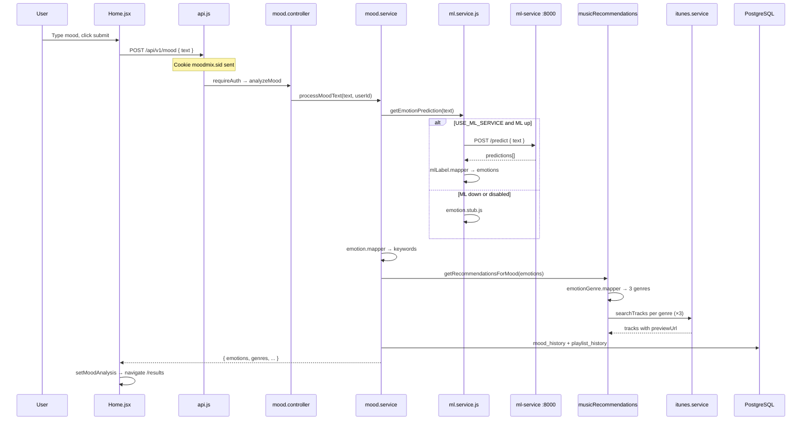

# MoodMix — Complete Project Guide

This document explains **what MoodMix does**, **how the three services connect**, and **the purpose of every important file** in the frontend, backend, and ML service.

For API endpoint details see [API.md](./API.md). For build history see [PHASES.md](./PHASES.md).

---

## 1. What is MoodMix?

MoodMix is an AI mood-based music app:

1. The user writes how they feel (text).
2. The system detects **emotions** (ML model or rule-based fallback).
3. It picks **music genres** that match those emotions.
4. It fetches **real songs** (iTunes Search API) — 3 songs per genre.
5. Results and history are saved **per logged-in user** (email/password sessions).

```
┌─────────────┐     REST + cookies      ┌─────────────┐     HTTP      ┌─────────────┐
│  Frontend   │ ──────────────────────► │   Backend   │ ────────────► │  ML Service │
│  React/Vite │ ◄────────────────────── │   Express   │ ◄──────────── │   FastAPI   │
│  :5173      │                         │   :5000     │               │   :8000     │
└─────────────┘                         └──────┬──────┘               └─────────────┘
                                               │
                                               │ SQL
                                               ▼
                                        ┌─────────────┐
                                        │ PostgreSQL  │
                                        └─────────────┘
                                               │
                                               │ HTTPS (no key)
                                               ▼
                                        ┌─────────────┐
                                        │ iTunes API  │
                                        └─────────────┘
```

---

## 2. Repository layout (monorepo)

| Path | Role |
|------|------|
| `frontend/` | React SPA — UI, routing, API calls |
| `backend/` | Node.js Express API — auth, mood pipeline, DB, iTunes |
| `ml-service/` | Python FastAPI — HuggingFace emotion model |
| `docs/` | Documentation (this file, API, phases, architecture) |
| `package.json` (root) | npm workspaces; `npm run dev` starts frontend + backend |
| `docker-compose.yml` | Optional Docker setup for services |

**Typical dev ports**

| Service | URL |
|---------|-----|
| Frontend | http://127.0.0.1:5173 |
| Backend | http://127.0.0.1:5000 |
| ML service | http://127.0.0.1:8000 |
| PostgreSQL | localhost:5432, database `moodmix` |

---

## 3. End-to-end flow (main user journey)

This is the path when a logged-in user submits mood text on **Home**.



**Auth flow (signup/login)** is separate: `Signup.jsx` / `Login.jsx` → `POST /auth/signup` or `/auth/login` → session stored in PostgreSQL `session` table → `GET /auth/me` on app load restores user in `AppContext`.

---

## 4. Frontend (`frontend/`)

### 4.1 Config & entry (not in `src/`)

| File | Purpose | Connects to |
|------|---------|-------------|
| `package.json` | Dependencies (React, Vite, Tailwind, Axios, React Router) | npm scripts: `dev`, `build` |
| `vite.config.js` | Dev server on `127.0.0.1:5173`; **proxies** `/api` → backend `:5000` | All `api.js` calls use relative `/api/v1` |
| `index.html` | HTML shell; mounts React at `#root` | `main.jsx` |
| `tailwind.config.js` | Tailwind theme (e.g. `moodmix-primary`) | `styles/index.css` |
| `postcss.config.js` | PostCSS for Tailwind | Build pipeline |
| `eslint.config.js` | Lint rules | — |
| `.env` / `.env.example` | `VITE_API_BASE_URL` (usually `/api/v1`) | `api.js` |
| `public/vite.svg` | Static asset | — |
| `Dockerfile` / `vercel.json` | Deploy config | Production hosting |

### 4.2 Entry & app shell

| File | Purpose | Connects to |
|------|---------|-------------|
| `src/main.jsx` | Boots React; wraps app in `BrowserRouter`; redirects `localhost` → `127.0.0.1` (session cookies) | `App.jsx`, `index.css` |
| `src/App.jsx` | Root component: `AppProvider` + `MainLayout` + `AppRoutes` | Context, layout, routes |
| `src/styles/index.css` | Global Tailwind imports and base styles | All pages |

> Each `.jsx` file under `src/` includes a top-of-file comment describing its purpose (for study notes).

### 4.3 Routing & layout

| File | Purpose | Connects to |
|------|---------|-------------|
| `src/routes/AppRoutes.jsx` | Defines routes: `/`, `/results`, `/login`, `/signup`, `/history`; wraps protected pages in `ProtectedRoute` | Page components |
| `src/components/layout/MainLayout.jsx` | Page wrapper: `Header` + main content + `Footer` | `Header`, `Footer`, children |
| `src/components/layout/Header.jsx` | Nav links; shows user name + Logout or Log in / Sign up | `AppContext`, `ROUTES` |
| `src/components/layout/Footer.jsx` | Footer text | — |

### 4.4 Global state & API

| File | Purpose | Connects to |
|------|---------|-------------|
| `src/context/AppContext.jsx` | **Global state**: `user`, `moodText`, `emotions`, `analysis` (genres, ML scores, etc.); loads user via `authApi.me()` on startup | All pages/hooks that need session or mood results |
| `src/services/api.js` | Axios instance (`withCredentials: true`); exports `moodApi`, `authApi`, `historyApi` | Backend `/api/v1/*` via Vite proxy |
| `src/utils/constants.js` | Route paths (`ROUTES`) and emotion name list | Router, components |

### 4.5 Hooks (data fetching logic)

| File | Purpose | Connects to |
|------|---------|-------------|
| `src/hooks/useMood.js` | `analyzeMood(text)` → `POST /mood`; manages `loading` / `error` | `Home.jsx`, `api.js` |
| `src/hooks/useHistory.js` | `GET /history` on mount; `refetch` for History page | `History.jsx`, `api.js` |

### 4.6 Pages

| File | Purpose | Connects to |
|------|---------|-------------|
| `src/pages/Home/Home.jsx` | Mood input + submit; calls `useMood` → stores result in context → navigates to Results | `MoodInput`, `MoodSubmitButton`, `useAppContext` |
| `src/pages/Results/Results.jsx` | Shows emotions, ML scores, **genre sections with songs**; links to History / Home | `GenreRecommendations`, `analysis` from context |
| `src/pages/History/History.jsx` | Lists past moods for **current user** with saved genres/tracks | `useHistory`, `GenreRecommendations` |
| `src/pages/Login/Login.jsx` | Email/password form → `authApi.login` → `setUser` → redirect | `authApi`, `ProtectedRoute` redirect target |
| `src/pages/Signup/Signup.jsx` | Register form → `authApi.signup` → auto-login | Same as Login |

### 4.7 Auth UI

| File | Purpose | Connects to |
|------|---------|-------------|
| `src/components/auth/ProtectedRoute.jsx` | If not logged in (and not `authLoading`), redirect to `/login` | Wraps Home, Results, History in `AppRoutes` |

### 4.8 Mood UI components

| File | Purpose | Connects to |
|------|---------|-------------|
| `src/components/mood/MoodInput.jsx` | Textarea for mood text; optional Enter-to-submit | `Home.jsx` |
| `src/components/mood/MoodSubmitButton.jsx` | Submit button with loading state | `Home.jsx` |

### 4.9 Music / playlist UI components

| File | Purpose | Connects to |
|------|---------|-------------|
| `src/components/playlist/GenreRecommendations.jsx` | Renders each **genre** as a section with a list of tracks | `Results.jsx`, `History.jsx` |
| `src/components/playlist/TrackRow.jsx` | One song row: art, title, artist, **audio preview**, Apple Music link | `GenreRecommendations` |
| `src/components/playlist/TrackList.jsx` | Flat list of tracks (legacy; Results no longer uses this) | Optional / older UI |
| `src/components/playlist/PlaylistGrid.jsx` | Grid of playlist cards (legacy) | Optional / older UI |
| `src/components/playlist/PlaylistCard.jsx` | Single playlist card (legacy) | `PlaylistGrid` |

### 4.10 Shared UI

| File | Purpose | Connects to |
|------|---------|-------------|
| `src/components/common/Button.jsx` | Styled button (`primary` / `secondary`) | Login, Signup, Header |
| `src/components/common/ErrorMessage.jsx` | Red error banner | Home, Login, Signup, History |
| `src/components/common/LoadingSpinner.jsx` | Spinner | History, ProtectedRoute |

### 4.11 Frontend connection summary

```
main.jsx → App.jsx → AppProvider (context) → MainLayout → AppRoutes
                                                      ↓
                    pages use hooks (useMood, useHistory) → api.js → Vite proxy → backend :5000
                    pages read/write AppContext (mood + analysis + user)
```

---

## 5. Backend (`backend/src/`)

The backend follows a **layered** pattern:

```
server.js → app.js → routes → controllers → services → models → PostgreSQL
                              ↓ validators / middleware
```

### 5.1 Startup & app config

| File | Purpose | Connects to |
|------|---------|-------------|
| `server.js` | **Entry point**: `connectDatabase()` then dynamic-import `app.js` and `listen(PORT)` | `database.js`, `app.js`, `env.js` |
| `app.js` | Express app: CORS, JSON body, **session middleware**, request logger, mounts `/api/v1`, error handler | `routes/index.js`, `session.js` |
| `config/env.js` | Reads `.env`: `PORT`, `DATABASE_URL`, `ML_SERVICE_URL`, `USE_ML_SERVICE`, `SESSION_SECRET` | Used everywhere |
| `config/database.js` | `pg` connection pool; runs `schema.sql` or `migrate-auth.sql` on startup | All `models/*` |
| `config/session.js` | `express-session` + `connect-pg-simple` (stores sessions in DB table `session`) | `auth.controller` sets `req.session.userId` |

### 5.2 Database SQL

| File | Purpose | Connects to |
|------|---------|-------------|
| `db/schema.sql` | **Fresh DB** tables: `users`, `mood_history`, `playlist_history`, `session` | `database.js` on first connect |
| `db/migrate-auth.sql` | **One-time upgrade** from old Spotify-user schema (drops/recreates tables) | `database.js` if `password_hash` column missing |

**Tables**

| Table | Stores |
|-------|--------|
| `users` | `email`, `password_hash`, `display_name` |
| `mood_history` | One row per mood analysis (`text`, `emotions[]`, `primary_emotion`, `spotify_keywords[]`, `user_id`) |
| `playlist_history` | JSONB blob per mood — today `{ genres: [...] }` |
| `session` | Express session payloads (login cookies) |

### 5.3 Routes (URL → controller)

| File | Purpose | Connects to |
|------|---------|-------------|
| `routes/index.js` | Mounts `/mood`, `/auth`, `/history` under `/api/v1` | All `*.routes.js` |
| `routes/mood.routes.js` | `POST /` → analyze mood (**requireAuth**) | `mood.controller.js` |
| `routes/auth.routes.js` | `POST /signup`, `/login`, `GET /me`, `POST /logout` | `auth.controller.js` |
| `routes/history.routes.js` | `GET /` → user history (**requireAuth**) | `history.controller.js` |

### 5.4 Controllers (HTTP in/out)

| File | Purpose | Connects to |
|------|---------|-------------|
| `controllers/mood.controller.js` | Validates body → `mood.service.processMoodText(text, req.userId)` | `mood.validator`, `mood.service` |
| `controllers/auth.controller.js` | Signup/login sets session; me/logout | `auth.service`, `User.model` |
| `controllers/history.controller.js` | Loads moods + parses stored `genres` from JSONB | `MoodHistory`, `PlaylistHistory` |

### 5.5 Middleware & validators

| File | Purpose | Connects to |
|------|---------|-------------|
| `middleware/auth.middleware.js` | `requireAuth` — 401 if no `req.session.userId`; sets `req.userId` | Mood + history routes |
| `middleware/errorHandler.js` | Catches errors; returns JSON (`ApiError` status codes) | All controllers |
| `middleware/requestLogger.js` | Logs method + path | — |
| `validators/mood.validator.js` | Ensures mood text is non-empty, reasonable length | `mood.controller` |
| `validators/auth.validator.js` | Email format, password length for signup/login | `auth.controller` |

### 5.6 Models (database access)

| File | Purpose | Connects to |
|------|---------|-------------|
| `models/User.model.js` | `findById`, `findByEmail`, `create`; `toPublic()` strips password | `auth.service`, `auth.controller` |
| `models/MoodHistory.model.js` | `create`, `findRecentByUserId` | `mood.service`, `history.controller` |
| `models/PlaylistHistory.model.js` | `create`, `findByMoodHistoryId` | `mood.service`, `history.controller` |

### 5.7 Utils & constants

| File | Purpose | Connects to |
|------|---------|-------------|
| `utils/rowMapper.js` | Maps SQL snake_case → camelCase for API JSON | All models |
| `utils/logger.js` | Simple console logger with levels | Services |
| `utils/ApiError.js` | Custom error with HTTP status | `auth.middleware`, services |
| `constants/emotions.js` | List of mood labels + `EMOTION_KEYWORD_MAP` | `emotion.mapper.js` |
| `constants/genres.js` | `EMOTION_GENRES` — each emotion → 2 genre definitions + iTunes search queries | `emotionGenre.mapper.js` |

### 5.8 Mood pipeline services

| File | Purpose | Connects to |
|------|---------|-------------|
| `services/mood/mood.service.js` | **Orchestrator**: ML/stub emotions → keywords → music genres → save DB | Everything below |
| `services/mood/emotion.stub.js` | Rule-based emotion detection from keywords in text (fallback) | `ml.service.js` when ML fails |
| `services/mood/emotion.mapper.js` | `mapEmotionsToKeywords()` using `EMOTION_KEYWORD_MAP` | `mood.service` (keywords stored in DB) |
| `services/mood/emotionGenre.mapper.js` | Picks up to 3 unique genres from detected emotions | `musicRecommendations.service.js` |

### 5.9 ML integration (backend → Python)

| File | Purpose | Connects to |
|------|---------|-------------|
| `services/ml/ml.service.js` | `getEmotionPrediction(text)` — tries `POST ml-service/predict`, else stub | `mlLabel.mapper`, `emotion.stub` |
| `services/ml/mlLabel.mapper.js` | Maps HuggingFace labels (`joy`, `sadness`, …) → MoodMix emotions (`happy`, `sad`, …) | `ml.service` |

### 5.10 Music services (iTunes — active path)

| File | Purpose | Connects to |
|------|---------|-------------|
| `services/music/musicRecommendations.service.js` | **Main music logic**: genres for mood → 3 iTunes searches in parallel → mock fallback | `mood.service` |
| `services/music/itunes.service.js` | `searchTracks(query, limit)` → Apple iTunes Search API | `musicRecommendations` |
| `services/music/mockGenres.service.js` | Static sample tracks per genre if iTunes fails | `musicRecommendations` |

### 5.11 Auth services

| File | Purpose | Connects to |
|------|---------|-------------|
| `services/auth/auth.service.js` | `signUp` / `logIn` with bcrypt | `User.model`, `auth.controller` |

### 5.12 Backend layer diagram

```
POST /mood
  mood.routes → requireAuth → mood.controller
    → mood.service
         ├─ ml.service → (HTTP) ml-service OR emotion.stub
         ├─ emotion.mapper
         ├─ musicRecommendations.service
         │     ├─ emotionGenre.mapper ← constants/genres.js
         │     ├─ itunes.service
         │     └─ mockGenres.service
         └─ MoodHistory + PlaylistHistory models → PostgreSQL
```

---

## 6. ML service (`ml-service/`)

Python **FastAPI** app that loads a HuggingFace emotion classifier once at startup.

### 6.1 Config & dependencies

| File | Purpose | Connects to |
|------|---------|-------------|
| `requirements.txt` | Python packages: `fastapi`, `uvicorn`, `transformers`, `torch`, etc. | `pip install` |
| `app/config/settings.py` | `HF_MODEL_NAME`, `PORT`, loads `.env` | `model_loader`, `huggingface_service` |
| `app/config/__init__.py` | Package marker | — |

### 6.2 Application entry

| File | Purpose | Connects to |
|------|---------|-------------|
| `app/main.py` | Creates FastAPI app; **lifespan** loads model on start; CORS; registers routers | `health`, `predict` routes |
| `app/__init__.py` | Package marker | — |

### 6.3 Routes (HTTP API)

| File | Purpose | Connects to |
|------|---------|-------------|
| `app/routes/health.py` | `GET /` — health + whether model is loaded | `ModelLoader` |
| `app/routes/predict.py` | `POST /predict` — accepts `{ text }`, returns `{ predictions: [{label, score}] }` | `EmotionService`, `PredictRequest/Response` schemas |
| `app/routes/__init__.py` | Package marker | — |

### 6.4 Schemas (request/response shapes)

| File | Purpose | Connects to |
|------|---------|-------------|
| `app/schemas/predict.py` | Pydantic models: `PredictRequest`, `PredictResponse`, `PredictionScore` | `predict.py` route validation |
| `app/schemas/__init__.py` | Package marker | — |

### 6.5 Services (ML logic)

| File | Purpose | Connects to |
|------|---------|-------------|
| `app/services/model_loader.py` | Singleton: downloads/loads `j-hartmann/emotion-english-distilroberta-base` pipeline | Called from `main.py` lifespan |
| `app/services/huggingface_service.py` | Runs `pipeline("text-classification")` on input text | `EmotionService` |
| `app/services/emotion_service.py` | Thin wrapper: `predict(text)` → `{ text, predictions }` | `predict.py` route |
| `app/services/__init__.py` | Package marker | — |

### 6.6 Placeholder packages

| File | Purpose |
|------|---------|
| `app/models/__init__.py` | Reserved for future DB models (unused) |
| `app/utils/__init__.py` | Reserved for helpers (unused) |

### 6.7 ML connection to backend

```
backend ml.service.js
  axios POST http://localhost:8000/predict { text }
    → predict.py
      → EmotionService
        → HuggingFaceService
          → ModelLoader pipeline
  ← { predictions: [{ label: "joy", score: 0.9 }, ...] }
  → mlLabel.mapper.js → { emotions: ["happy", ...], primary: "happy" }
```

**Run ML service:**

```bash
cd ml-service
# activate venv, then:
uvicorn app.main:app --reload --host 127.0.0.1 --port 8000
```

Set in `backend/.env`: `USE_ML_SERVICE=true`, `ML_SERVICE_URL=http://127.0.0.1:8000`.

---

## 7. Root & docs files

| File | Purpose |
|------|---------|
| `package.json` | Monorepo scripts: `npm run dev` (backend + frontend) |
| `docker-compose.yml` | Docker orchestration (if you deploy with containers) |
| `docs/API.md` | REST endpoint reference |
| `docs/BACKEND.md` | **Backend file reference** — every file in `backend/` |
| `docs/PHASES.md` | What was built in each development phase |
| `docs/ARCHITECTURE.md` | High-level architecture notes |
| `docs/PROJECT_GUIDE.md` | **This file** — full file map |
| `backend/.env` | Secrets and URLs for backend (not committed) |
| `backend/.env.example` | Template for backend env vars |
| `frontend/.env.example` | Template for `VITE_API_BASE_URL` |

---

## 8. Environment variables cheat sheet

### Backend (`backend/.env`)

| Variable | Purpose |
|----------|---------|
| `PORT` | API port (default 5000) |
| `DATABASE_URL` | PostgreSQL connection string |
| `SESSION_SECRET` | Signs session cookies |
| `ML_SERVICE_URL` | e.g. `http://127.0.0.1:8000` |
| `USE_ML_SERVICE` | `true` = call Python ML; `false` = stub only |
| `FRONTEND_URL` | CORS in production |

### Frontend (`frontend/.env`)

| Variable | Purpose |
|----------|---------|
| `VITE_API_BASE_URL` | Usually `/api/v1` (Vite proxies to backend) |

### ML service (`ml-service/.env` optional)

| Variable | Purpose |
|----------|---------|
| `HF_MODEL_NAME` | HuggingFace model id |
| `PORT` | Default 8000 |

---

## 9. What to read first (learning order)

1. **`docs/PROJECT_GUIDE.md`** (this file) — big picture.
2. **`frontend/src/pages/Home/Home.jsx`** + **`hooks/useMood.js`** — user action.
3. **`backend/src/services/mood/mood.service.js`** — core business logic.
4. **`backend/src/services/music/musicRecommendations.service.js`** — genre + iTunes.
5. **`backend/src/services/ml/ml.service.js`** + **`ml-service/app/routes/predict.py`** — emotions.
6. **`frontend/src/context/AppContext.jsx`** + **`pages/Results/Results.jsx`** — how UI shows data.

---

## 10. Quick troubleshooting

| Problem | Likely cause |
|---------|----------------|
| `EADDRINUSE :5000` | Old backend still running — kill process on port 5000 |
| 401 on `/mood` | Not logged in — go to `/login` |
| Emotions always "stub" | ML service not running or `USE_ML_SERVICE=false` |
| No song previews | iTunes returned no `previewUrl` for those tracks |
| Empty history | Different user account or DB was migrated (tables reset) |
| API unreachable from browser | Backend down or wrong host — use `127.0.0.1:5173` not `localhost` |

---

## 11. File count summary

| Area | Active source files (approx.) |
|------|------------------------------|
| Frontend `src/` | 28 |
| Backend `src/` | 44 |
| ML `app/` | 8 Python modules + package `__init__` files |
| Docs | 5 markdown guides |

Ignore `node_modules/`, `venv/`, `frontend/dist/` — generated dependencies and build output, not application source.

---

*Last updated: May 2026 — Phases 1–4 complete (session auth, ML + stub, iTunes genre recommendations).*
